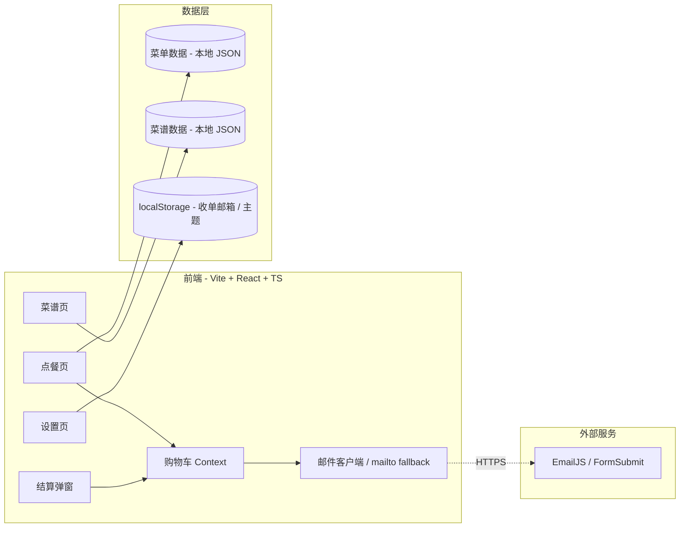
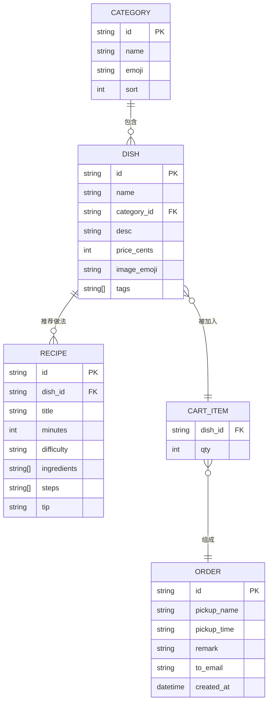

# 技术架构：轻享点餐小程序

## 1. 架构设计



## 2. 技术说明

- **构建工具**：Vite 5（`npm create vite@latest` 模板：`react-ts`）
- **前端框架**：React 18 + TypeScript
- **样式方案**：Tailwind CSS 3（自定义品牌色 / 字体变量）
- **状态管理**：React Context（`CartContext`）+ `useReducer` 处理购物车
- **路由**：React Router v6（`/`、`/recipes`、`/settings`）
- **邮件方案（双轨）**：
  1. **首选**：EmailJS（前端直发，无需后端，用户在前端填 Service ID / Template ID / Public Key 并写入 localStorage）
  2. **降级**：当未配置 EmailJS 时，点击「确认下单」会调用 `mailto:` 链接唤起用户默认邮件客户端，预填好订单内容，收件人即为"收单邮箱"
- **动画**：Framer Motion（弹窗滑入 / 成功页签到 / 菜谱卡片切换）
- **数据**：内置 `src/data/menu.json` 与 `src/data/recipes.json`，菜谱与菜单通过 `id` 关联
- **后端**：无（纯前端，符合"简单一点"诉求）
- **数据库**：无
- **图标**：自绘 SVG + Emoji，无外部图标库

## 3. 路由定义

| 路由 | 用途 |
|------|------|
| `/` | 点餐主页：分类 + 商品 + 购物车浮窗 |
| `/checkout-success` | 下单成功页 + 「查看菜谱」入口 |
| `/recipes` | 菜谱推荐页（基于本次订单） |
| `/settings` | 收单邮箱 / EmailJS 配置 / 主题前缀 |

## 4. API 定义

本项目不维护自有后端，仅对接 EmailJS（无服务端时）或调用浏览器 `mailto:`：

### 4.1 EmailJS 客户端调用（前端 SDK）

```ts
type EmailJsConfig = {
  serviceId: string;     // 形如 "service_xxx"
  templateId: string;    // 形如 "template_xxx"
  publicKey: string;     // 形如 "user_xxx" 或 Public Key
};

type OrderPayload = {
  to_email: string;        // 收单邮箱
  subject: string;         // 邮件主题
  order_id: string;        // 订单号（时间戳 + 4 位随机）
  pickup_name: string;     // 取餐人
  pickup_time: string;     // 取餐时间
  remark: string;          // 备注
  items_html: string;      // 订单明细 HTML
  total_qty: number;       // 商品总件数
  recipe_hint: string;     // 菜谱推荐摘要
};

declare function emailjs.send(
  serviceId: string,
  templateId: string,
  payload: Record<string, unknown>,
  options: { publicKey: string }
): Promise<{ status: number; text: string }>;
```

### 4.2 mailto 降级调用

```ts
function buildMailtoLink(payload: OrderPayload): string {
  const body = encodeURIComponent(/* 同 items_html 的纯文本版本 */);
  return `mailto:${encodeURIComponent(payload.to_email)}?subject=${encodeURIComponent(payload.subject)}&body=${body}`;
}
```

## 5. 服务端架构图

无后端，本节不适用。

## 6. 数据模型

### 6.1 数据模型定义



### 6.2 数据定义语言

菜单 / 菜谱使用 JSON 文件持久化（`src/data/*.json`），启动时通过 `import` 加载；订单不持久化，结算完成后仅生成订单号留存在内存中供成功页 / 菜谱页使用。

```jsonc
// src/data/menu.json (节选)
[
  {
    "id": "tomato-egg",
    "name": "番茄炒蛋",
    "category_id": "hot",
    "desc": "国民家常菜，酸甜嫩滑",
    "price_cents": 1800,
    "image_emoji": "🍅",
    "tags": ["热销", "快手", "下饭"]
  }
  // ...
]
```

```jsonc
// src/data/recipes.json (节选)
[
  {
    "id": "tomato-egg-recipe",
    "dish_id": "tomato-egg",
    "title": "5 分钟完美番茄炒蛋",
    "minutes": 5,
    "difficulty": "零失败",
    "ingredients": ["番茄 2 个", "鸡蛋 3 个", "葱花 适量", "糖 1 勺", "盐 少许"],
    "steps": [
      "鸡蛋打散加少许盐",
      "番茄切块",
      "热油下蛋液，凝固即盛出",
      "锅中再加少许油，炒番茄至出沙",
      "加糖、少量水煮 30 秒，回蛋翻匀，撒葱花"
    ],
    "tip": "糖是灵魂，可中和番茄酸；蛋液里加几滴水更嫩"
  }
]
```

## 7. 部署

- 静态构建：`npm run build`，产物输出到 `dist/`
- 预览：`npm run preview`（端口 4173）
- 部署：纯静态，可托管在 Vercel / Netlify / GitHub Pages / IGA Pages

## 8. 关键交互细节

1. **购物车**：`CartContext` 暴露 `add / dec / clear / items / totalQty`
2. **邮件触发**：提交时先读 `localStorage.qx_emailjs_config`；存在则走 EmailJS，否则 `window.location.href = mailto:...`
3. **订单号**：`Date.now().toString(36).toUpperCase() + 4 位随机大写字母`
4. **菜谱推荐**：结算时按所点 `dish_id` 查 `recipes.json`，最多取 2 道；若某道菜无菜谱则跳过
5. **成功页防误关**：使用 `react-router` 的 `useBlocker` 在提交中禁用返回
